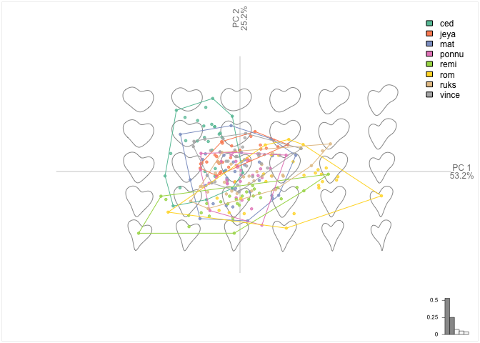

<!--README.md is generated from README.Rmd. Please edit that file -->

## Momocs

<!--Badges -->

[](https://www.tidyverse.org/lifecycle/#stable)
[](https://github.com/MomX/Momocs/actions)
[](https://codecov.io/github/MomX/Momocs?branch=master)
[](http://cran.r-project.org/package=Momocs)


### Installation

The last released version can be installed from
[CRAN](https://CRAN.R-project.org/package=Momocs) with:

``` r
install.packages("Momocs")
```

But I recommend using (and only support) the development version from
GitHub with:

``` r
# install.packages("devtools")
devtools::install_github("MomX/Momocs")
```

<!--
## Features
__Matrices of xy-coordinates__
* ~100 generic tools like centering, scaling, rotating, calculating area, perimeter, etc. Full list with `apropos("coo_")`
* generic plotters: `coo_plot` and `g` (work in progress)

__Data acquisition + Babel__

* Outline extraction from black mask/silhouettes `.jpgs`
* Landmark definition on outlines (`def_ldk` or via [StereoMorph](https://github.com/aaronolsen/StereoMorph))
* Open curves digitization with bezier curves (via [StereoMorph](https://github.com/aaronolsen/StereoMorph))
* Import/Export from/to `.nts`, `.tps`, `PAST`, `.txt`, etc.

__Outline analysis__

* Elliptical Fourier analysis (`efourier`)
* Radii variation (`rfourier`)
* Radii variation - curvilinear abscissa (`sfourier`)
* Tangent Angle Fourier analysis (`tfourier`)

__Open-outlines__

* Natural (raw) polynomials (`npoly`)
* Orthogonal (Legendre) polynomials (`opoly`)
* Discrete Cosinus Transform (`dfourier`)
* `bezier` core functions

__Configuration of landmarks__

* Full Generalized Procrustes Adjustment (`fgProcrustes`)
* Sliding semi-landmarks (`fgsProcrustes`)

__Traditional morphometrics and global shape descriptors__

* Facilities for multivariate analysis (see `flowers`)
* A long list of shape scalars (eg. `coo_eccentricity`, `coo_rectilinearity`, etc.)

__Data handling__

* Easy data manipulation with `filter`, `select`, `slice`, `mutate` and other verbs ala [dplyr](https://github.com/hadley/dplyr/)
* New verbs useful for morphometrics such as `combine` and `chop`, to handle several 2D views
* Permutation methods to resample data (`perm`, `breed`)

__Multivariate analysis__

* Mean shape (groupwise) calculations (`mshapes`)
* Principal component analysis (`PCA`)
* Multivariate analysis of variance (`MANOVA` + pairwise testing `MANOVA_PW`)
* Linear discriminant analysis and screening (`LDA`)
* Hierarchical clustering (`CLUST`)
* K-means (`KMEANS`)

__Graphical methods__

* Family pictures and quick inspection of whole datasets (`stack` and `panel`)
* Some `ggplot2` plots, when useful (and convet Momocs' objects into `data.frames it with `as_df`)
* Morphological spaces for PCA
* Thin plate splines and variation around deformation grids


__Misc__

* Datasets for all types of data (`apodemus`, `bot`, `chaff`, `charring`, `flower`,  `hearts`, `molars`, `mosquito`, `mouse`, `oak`, `olea`, `shapes`, `trilo`, `wings`)
* [Shiny](http://shiny.rstudio.com/) demonstrators/helpers. See [Momecs](https://github.com/vbonhomme/Momecs/)
* [Online documentation](http://vbonhomme.github.io/Momocs/)
-->

### Example

This is a basic example of a complete analysis doing: inspection,
normalization of raw outlines, elliptical Fourier transforms,
dimmensionality reduction and classification, using a single line.

``` r
library(Momocs)
```

``` r
devtools::load_all()
#> ℹ Loading Momocs
#> Registered S3 method overwritten by 'vegan':
#>   method     from      
#>   rev.hclust dendextend
```

``` r
hearts %T>%                    # A toy dataset
  stack() %>%                  # Take a family picture of raw outlines
  fgProcrustes() %>%           # Full generalized Procrustes alignment
  coo_slide(ldk = 2) %T>%      # Redefine a robust 1st point between the cheeks
  stack() %>%                  # Another picture of aligned outlines
  efourier(6, norm=FALSE) %>%  # Elliptical Fourier Transforms
  PCA() %T>%                   # Principal Component Analysis
  plot_PCA(~aut) %>%           # A PC1:2 plot
  LDA(~aut) %>%                # Linear Discriminant Analysis
  plot_CV()                    # And the confusion matrix after leave one out cross validation
```

<!-- --><!-- -->

    #> Warning: `guides(<scale> = FALSE)` is deprecated. Please use `guides(<scale> =
    #> "none")` instead.

<!-- --><!-- -->
